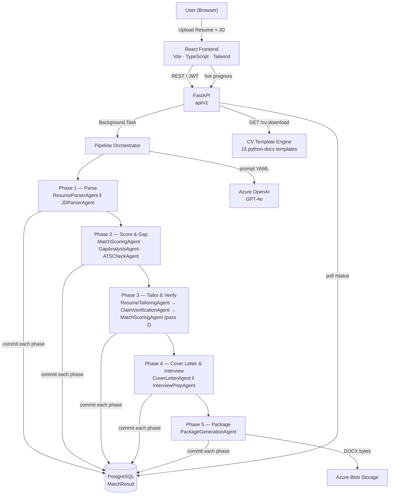

<div align="center">

# TailorIQ

**AI-powered resume optimisation platform — from JD to interview-ready in minutes**

[](https://www.python.org/)
[](https://fastapi.tiangolo.com/)
[](https://react.dev/)
[](https://www.typescriptlang.org/)
[](https://azure.microsoft.com/en-us/products/ai-services/openai-service)
[](https://www.postgresql.org/)
[](LICENSE)

</div>

---

## What is TailorIQ?

TailorIQ is a full-stack Agentic AI platform that turns a raw resume and a job description into a complete, interview-ready application package — in one click.

It runs a 5-phase AI pipeline powered by Azure OpenAI (GPT-4o) that **parses**, **scores**, **tailors**, **verifies**, and **packages** your application. The result is a scored alignment report, a truthfully tailored CV in your chosen professional template, a personalised cover letter, and a custom interview preparation guide — all downloadable as DOCX files.

> **Core principle:** TailorIQ never invents employment history, dates, employers, degrees, certifications, achievements, or skills not present in the source resume. It only rephrases, reorders, emphasises, or inserts JD keywords where truthfully supported. Every claim is verified by a dedicated `ClaimVerificationAgent` before output.

---

## Features

### Resume Intelligence
- **ATS Alignment Score** — weighted 4-category scoring (Technical Skills 40%, Domain Certifications 25%, Experience Relevance 20%, Achievement Alignment 15%)
- **Gap Analysis** — identifies missing skills, certifications, and keywords versus the JD
- **ATS Compatibility Check** — flags formatting, keyword density, and structural issues
- **Before/After Score Comparison** — shows exactly how tailoring improved your score

### Document Generation
- **Tailored Resume** — rewrites section content to mirror JD language while preserving factual accuracy
- **15 Professional CV Templates** — instant template switching with live preview; one-click DOCX download per template
- **Cover Letter** — role-specific, personalised to the JD and your experience
- **Interview Preparation Guide** — behavioural and technical questions with STAR skeleton answers

### Platform
- **Real-time pipeline progress** — live status updates per phase during analysis
- **JWT authentication** — secure multi-user support with per-user run isolation
- **Download bundle** — single ZIP with all three DOCX documents
- **Observability** — OpenTelemetry tracing, structured logging, PII redaction

---

## ROI

| Metric | Manual Process | With TailorIQ |
|--------|---------------|---------------|
| Resume tailoring time | 2–4 hours per application | ~5 minutes |
| Cover letter writing | 30–60 minutes | Included in pipeline |
| Interview prep | 2–3 hours | Instant guide generated |
| ATS keyword match rate | Varies, often <50% | Consistently 80%+ post-tailoring |
| Applications per week | 2–3 (limited by time) | 10–20 (time no longer the constraint) |
| Fabrication risk | Human error possible | Zero — claim verification agent enforced |

For a hiring manager or recruiter deploying TailorIQ internally: a team of 10 active job seekers each saving 4 hours per application × 5 applications/week = **200 person-hours saved weekly**.

---

## Architecture



### Pipeline Phases

| # | Phase | Agents | Mode |
|---|-------|--------|------|
| 1 | **Parse** | `ResumeParserAgent`, `JDParserAgent` | Parallel |
| 2 | **Score & Gap** | `MatchScoringAgent` (pass 1), `GapAnalysisAgent`, `ATSCheckAgent` | Parallel |
| 3 | **Tailor & Verify** | `ResumeTailoringAgent` → `ClaimVerificationAgent` → `MatchScoringAgent` (pass 2) | Sequential |
| 4 | **Cover Letter & Interview** | `CoverLetterAgent`, `InterviewPrepAgent` | Parallel |
| 5 | **Package** | `PackageGenerationAgent` | Sequential |

Each phase commits its results to PostgreSQL immediately so the frontend polling endpoint reflects real-time progress. A floor guard ensures the pass-2 tailored score never regresses below the pass-1 original score.

---

## CV Template Gallery

15 professional templates — each available as both a live on-screen preview and a downloadable DOCX:

| # | Template | Style |
|---|----------|-------|
| 1 | ATS Classic | Clean single-column, Calibri, black rules — maximally ATS-safe |
| 2 | Microsoft Modern | Navy `#2b579a` header band — Word 2024 aesthetic |
| 3 | Corporate Blue | Navy gradient rule, centred header, boardroom formal |
| 4 | Executive Dark | Dark `#1a1a2e` sidebar, indigo tag pills, two-column layout |
| 5 | Clean Minimal | Light-weight Helvetica, hairline rules, Swiss modern |
| 6 | Charcoal Gold | Dark `#1e2a3a` header with gold `#c9a84c` accent bar |
| 7 | Elegant Serif | Georgia serif, warm cream background, ornament divider |
| 8 | Tech Pro | Dark terminal `#0d1117`, monospace, blue `#79c0ff` headings |
| 9 | Creative Teal | Teal-to-cyan gradient header `#0d9488 → #0891b2` |
| 10 | LinkedIn Style | LinkedIn PDF export look with avatar initials |
| 11 | Harvard Classic | Times New Roman, crimson `#a51c30` section headings |
| 12 | Compact Dense | Arial, slate shaded heading pills, maximum content density |
| 13 | Two Column Split | Navy sidebar with skill-bar indicators, two-column DOCX table |
| 14 | Green Professional | Forest green `#14532d` with gradient accent bar |
| 15 | Purple Modern | Deep purple gradient header `#4c1d95 → #a855f7`, dot bullets |

---

## Technology Stack

### Backend

| Layer | Technology | Version | Purpose |
|-------|-----------|---------|---------|
| Framework | FastAPI | 0.115 | Async REST API, OpenAPI docs |
| ASGI Server | Uvicorn | 0.30 | Production-grade async server |
| Validation | Pydantic v2 | 2.9 | Request/response schemas, LLM output coercion |
| ORM | SQLAlchemy (async) | 2.0 | Async database access |
| Database Driver | asyncpg | 0.30 | Async PostgreSQL driver |
| Migrations | Alembic | 1.13 | Schema versioning |
| Auth | python-jose + bcrypt | 3.3 / 4.2 | JWT tokens, password hashing |
| AI Client | openai | 1.50 | Azure OpenAI API |
| Document Gen | python-docx | 1.1 | 15-template DOCX generation |
| Cloud Storage | azure-storage-blob | 12.22 | Artifact persistence |
| Observability | OpenTelemetry | 1.27 | Distributed tracing + metrics |
| Caching | Redis | 5.1 | Rate limiting, response cache |
| Prompt Management | PyYAML | 6.0 | Versioned prompt templates (`prompts/v1/`) |
| Testing | pytest + hypothesis | 8.3 / 6.112 | Unit + property-based tests |
| Linting | ruff + mypy | latest | Code quality + static typing |

### Frontend

| Layer | Technology | Version | Purpose |
|-------|-----------|---------|---------|
| UI Framework | React | 18.3 | Component-based UI |
| Language | TypeScript | 5.5 | Type-safe frontend |
| Build Tool | Vite | 5.4 | Fast HMR dev server, optimised production build |
| Styling | Tailwind CSS | 3.4 | Utility-first styling |
| State Management | Zustand | 4.5 | Lightweight global state |
| HTTP Client | Axios | 1.7 | API communication with JWT interceptor |
| Routing | React Router | 6.26 | Client-side routing |
| Template Styles | Custom CSS | — | 15 CV template classes (`cv-templates.css`) |

### Infrastructure

| Component | Technology |
|-----------|-----------|
| Database | PostgreSQL 16 |
| AI | Azure OpenAI Service (GPT-4o, configurable) |
| Storage | Azure Blob Storage |
| Containerisation | Docker + Docker Compose |
| Deployment target | Azure Container Apps |

---

## Developer Guide

### Prerequisites

- Python 3.11+
- Node.js 20+
- PostgreSQL 16 (local or cloud)
- Azure OpenAI resource with a deployed model
- Docker Desktop (optional, for Option B)

### Environment Setup

```powershell
# Clone the repo
git clone https://github.com/your-org/JDCVMatcherAI.git
cd JDCVMatcherAI

# Copy and configure environment
Copy-Item backend/.env.example backend/.env
# Open backend/.env and fill in:
#   AZURE_OPENAI_ENDPOINT, AZURE_OPENAI_API_KEY, AZURE_OPENAI_DEPLOYMENT_NAME
#   DATABASE_URL (PostgreSQL connection string)
#   SECRET_KEY (JWT signing key — generate with: python -c "import secrets; print(secrets.token_hex(32))")
```

### Option A — Local Development (no Docker)

```powershell
# ── Backend ──────────────────────────────────────────
cd backend
python -m venv venv
.\venv\Scripts\Activate.ps1
pip install -r requirements.txt

# Run database migrations
alembic upgrade head

# Start backend (with hot reload)
uvicorn app.main:app --reload --port 8000
```

```powershell
# ── Frontend (new terminal) ───────────────────────────
cd frontend
npm install
npm run dev -- --port 5173
```

| Service | URL |
|---------|-----|
| Frontend | http://localhost:5173 |
| Backend API | http://localhost:8000 |
| Swagger UI | http://localhost:8000/docs |
| ReDoc | http://localhost:8000/redoc |

### Option B — Docker Compose

```powershell
# Start all services (PostgreSQL + backend + frontend)
docker compose up -d

# Run migrations inside the container
docker compose exec backend alembic upgrade head

# Tail logs
docker compose logs -f backend
```

| Service | URL |
|---------|-----|
| Frontend | http://localhost:3000 |
| Backend API | http://localhost:8000 |
| Swagger UI | http://localhost:8000/docs |

### Project Structure

```
JDCVMatcherAI/
├── backend/
│   ├── app/
│   │   ├── agents/               # 10 AI agents + cv_templates/
│   │   │   ├── base.py           # BaseAgent: LLM call, retry, token tracking
│   │   │   ├── resume_parser.py
│   │   │   ├── jd_parser.py
│   │   │   ├── match_scoring.py
│   │   │   ├── gap_analysis.py
│   │   │   ├── ats_check.py
│   │   │   ├── resume_tailoring.py
│   │   │   ├── claim_verification.py
│   │   │   ├── cover_letter.py
│   │   │   ├── interview_prep.py
│   │   │   ├── package_generation.py
│   │   │   └── cv_templates/     # 15-template DOCX renderer
│   │   │       ├── base.py       # TemplateConfig + CVDocxRenderer
│   │   │       └── registry.py   # 15 configs + generate_cv_docx()
│   │   ├── api/                  # FastAPI route handlers
│   │   │   ├── analysis.py       # /analysis — run, status, results, cv-download
│   │   │   ├── auth.py           # /auth — register, login, refresh
│   │   │   ├── downloads.py      # /downloads — ZIP bundle, individual files
│   │   │   ├── resumes.py        # /resumes — upload, list
│   │   │   └── jobs.py           # /jobs — JD create, list
│   │   ├── orchestrator/
│   │   │   ├── pipeline.py       # 5-phase PipelineOrchestrator
│   │   │   ├── circuit_breaker.py
│   │   │   └── retry.py
│   │   ├── models/db.py          # SQLAlchemy ORM: User, Resume, JD, MatchResult
│   │   ├── schemas/              # Pydantic schemas per agent output
│   │   ├── services/
│   │   │   ├── llm_service.py    # Azure OpenAI wrapper
│   │   │   ├── auth_service.py   # JWT + bcrypt
│   │   │   └── prompt_loader.py  # YAML prompt template loader
│   │   ├── prompts/v1/           # 9 versioned YAML prompt templates
│   │   ├── semantic/             # Keyword synonym mapping (YAML + Python)
│   │   ├── security/sanitizer.py # Input sanitization
│   │   ├── observability/        # OpenTelemetry metrics, tracing, PII redactor
│   │   ├── config.py             # Pydantic settings
│   │   ├── dependencies.py       # FastAPI dependency injection
│   │   └── main.py               # App factory, CORS, exception handlers
│   ├── alembic/                  # Database migrations
│   ├── tests/
│   │   ├── unit/                 # Per-agent unit tests
│   │   └── property/             # Hypothesis property-based tests
│   ├── requirements.txt
│   └── Dockerfile
├── frontend/
│   └── src/
│       ├── api/                  # Axios API clients (analysis, auth, downloads)
│       ├── components/
│       │   ├── dashboard/        # ScoreCard, CategoryBreakdown, KeywordPanel,
│       │   │                     # TemplateSelector, TailoredResumePreview,
│       │   │                     # CoverLetterPanel, InterviewGuidePanel,
│       │   │                     # DownloadActions, templateDefinitions.ts
│       │   ├── upload/           # ResumeUpload, JDInput, AnalyzeButton
│       │   └── common/           # LoadingState, ErrorBoundary, CollapsiblePanel
│       ├── pages/                # Dashboard, LoginPage, RegisterPage
│       ├── store/                # authStore.ts, analysisStore.ts (Zustand)
│       └── styles/               # globals.css, cv-templates.css (15 templates)
├── docs/superpowers/specs/       # Design specs
├── docker-compose.yml
└── README.md
```

### Running Tests

```powershell
cd backend

# All tests
pytest tests/ -v

# Unit tests only
pytest tests/unit/ -v

# Property-based tests
pytest tests/property/ -v

# With coverage report
pytest tests/ --cov=app --cov-report=html
```

### Adding a New CV Template

1. **Add the config** to `backend/app/agents/cv_templates/registry.py`:
```python
TEMPLATE_REGISTRY["my_template"] = TemplateConfig(
    id="my_template",
    name="My Template",
    font_name="Calibri",
    header_bg=(30, 80, 120),          # RGB tuple or None
    heading_color=(30, 80, 120),
    heading_style="color_rule",        # "rule" | "color_rule" | "left_border" | "shaded_box"
    name_size=22.0,
    name_align="left",
)
```

2. **Add the definition** to `frontend/src/components/dashboard/templateDefinitions.ts`:
```typescript
{
  id: 'my_template',
  name: 'My Template',
  description: 'One-line description',
  accentColor: '#1e5078',
  headerBg: '#1e5078',
  headingColor: '#1e5078',
  fontHint: 'Calibri',
  layout: 'single',
}
```

3. **Add the CSS** to `frontend/src/styles/cv-templates.css`:
```css
.tmpl-my_template .cv-preview-header { background: #1e5078; }
.tmpl-my_template .cv-name           { color: #fff; }
.tmpl-my_template .cv-section-heading { color: #1e5078; border-bottom: 2px solid #1e5078; }
```

That's it — no other files need changing.

### Adding a New AI Agent

1. Create `backend/app/agents/my_agent.py` inheriting from `BaseAgent`
2. Define an input schema (`AgentInput(BaseModel)`) and output schema
3. Implement `async def execute(self, input_data) -> AgentOutput`
4. Wire it into the relevant phase in `orchestrator/pipeline.py`
5. Add a versioned YAML prompt to `backend/app/prompts/v1/my_agent.yaml`

### Code Style

```powershell
# Lint (auto-fix)
cd backend && ruff check . --fix

# Type check
mypy app/

# Format
ruff format .
```

---

## Environment Variables

See [`backend/.env.example`](backend/.env.example) for the full list. Key variables:

| Variable | Description |
|----------|-------------|
| `AZURE_OPENAI_ENDPOINT` | Azure OpenAI resource endpoint URL |
| `AZURE_OPENAI_API_KEY` | Azure OpenAI API key |
| `AZURE_OPENAI_DEPLOYMENT_NAME` | Deployed model name (e.g. `gpt-4o`) |
| `DATABASE_URL` | Async PostgreSQL connection string (`postgresql+asyncpg://...`) |
| `SECRET_KEY` | JWT signing key (min 32 hex chars) |
| `AZURE_STORAGE_ACCOUNT_NAME` | Azure Blob Storage account |
| `AZURE_STORAGE_CONTAINER_NAME` | Container for DOCX artifacts |
| `CORS_ORIGINS` | Comma-separated allowed origins (e.g. `http://localhost:5173`) |

---

## API Reference

Interactive docs available at `/docs` (Swagger UI) and `/redoc` (ReDoc) when running in development mode.

Key endpoints:

| Method | Path | Description |
|--------|------|-------------|
| `POST` | `/api/v1/auth/register` | Create account |
| `POST` | `/api/v1/auth/login` | Obtain JWT |
| `POST` | `/api/v1/resumes/` | Upload resume (PDF/DOCX/TXT) |
| `POST` | `/api/v1/jobs/` | Create job description |
| `POST` | `/api/v1/analysis/run` | Start analysis pipeline |
| `GET` | `/api/v1/analysis/{run_id}/status` | Poll pipeline progress |
| `GET` | `/api/v1/analysis/{run_id}` | Get full results |
| `GET` | `/api/v1/analysis/{run_id}/cv-download?template=microsoft_modern` | Download CV DOCX in chosen template |
| `GET` | `/api/v1/downloads/{run_id}/all` | Download ZIP bundle (CV + cover letter + interview guide) |

---

## Contributing

1. Fork the repo and create a feature branch: `git checkout -b feat/your-feature`
2. Run `ruff check . && mypy app/` before pushing
3. Add or update tests for any agent or API changes
4. Open a pull request — include a short description of the change and any new environment variables needed

---

## License

MIT — see [LICENSE](LICENSE) for details.
